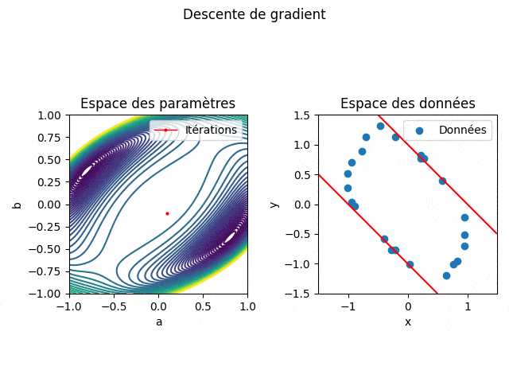
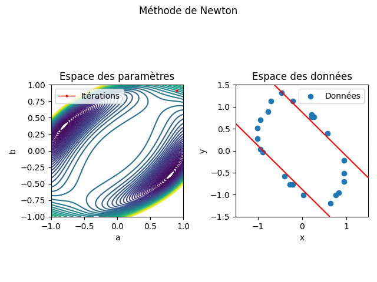

# Fit d'hyperquadrique

## Objectif

L'objectif du projet est d'identifier les paramètres d'une hyperquadrique
approchant au mieux un contour défini par un nuage de points. Dans un premier
temps, il est proposé de travailler sur un problème simplifié ne comportant que
deux paramètres à identifier pour comprendre la démarche à mettre en œuvre sur
le problème général.

Le problème simplifié à deux inconnues permet de visualiser le fonctionnement de
la méthode de recherche de ces deux paramètres et ainsi d'analyser sont
comportement et ses conditions de convergence. Les méthodes implémentées ici
sont la descente de gradient et la méthode de Newton.

## Strcuture du projet

Le dossier *subproblem* contient les scripts du problème simplifié, tandis que le
dossier *fullProblem* contient ceux du problèmes général.

## Améliorations

- [ ] Réécrtiture de la solution selon un paradigme objet
- [x] ajout d'une animation
- [ ] amélioration de la robustesse de la solution généralisée
- [ ] amélioration de performance via *Cython*

## Résultats

### Descente de gradient

Particulièrement lente autour des points selles mais robuste.

### Méthode de Newton

Rapide mais ne différencie pas les points selles des minima.

